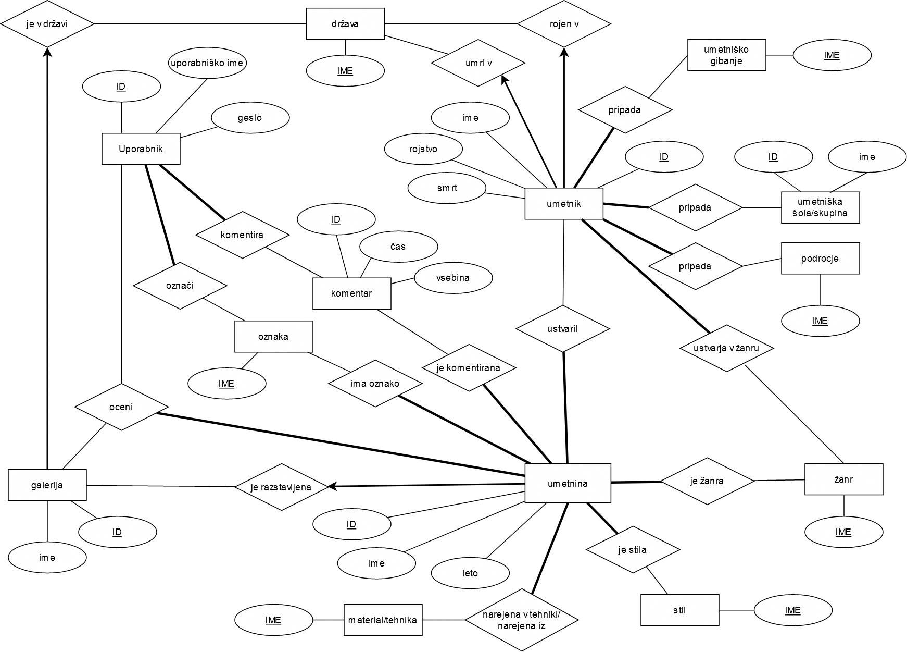

# OPB-umetnine
OPB projekt na temo umetnin in umetnikov

### Binder
[](https://mybinder.org/v2/gh/tomazderca/OPB-umetnine/master?urlpath=proxy/8000/)


#Opis
Umetnine je spletna aplikacija, ki uporabnikom omogoča enostavno brskanje med umetninami in njihovimi avtorji. Aplikacija omogoča, da se uporabnik registrira, oziroma prijavi, če že ima račun, kar mu omogoča, da tudi sam dodaja nove umetnine v bazo. Poleg tega ima tudi možnost komentiranja in všečkanja umetnin. Umetnine so opremljene tudi s ključnimi besedami, zato je mogoče tudi tematsko iskanje slik.

#Uporaba
Naložite aplikacijo. Za delovanje je potrebno namestiti še pakete iz **requirements.txt**.
```bash
pip install -r requirements.txt
```
Potem poženite server npr. z ukazom 
```bash
python manage.py runserver
```

Začetni diagram baze:

